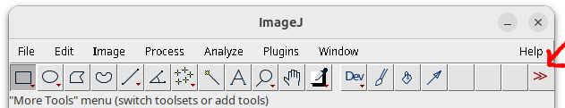
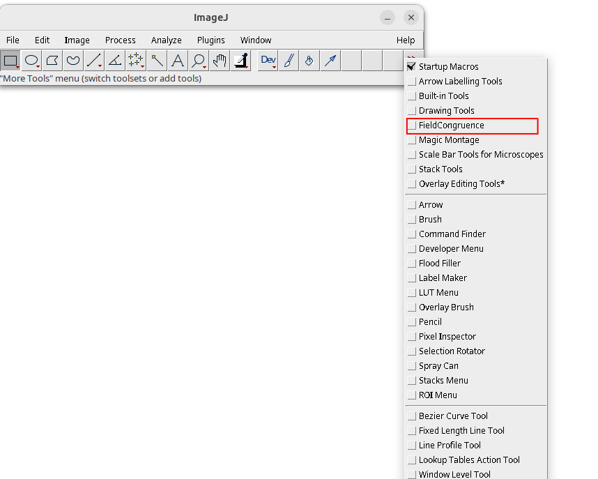
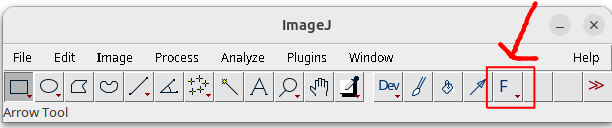

# field_congruence_using_film
A macro program written for Image J to analyze radiation field congruence in radiographic film

# Installation
1. Download the raw .ijm file.
2. Go to the folder where ImageJ is installed. Go to .../ImageJ/macros/toolsets
3. Paste the ijm file in the toolset folder
4. Open ImageJ.
5. Open an image in ImageJ.
6. Click on >> symbol at the end of the toolbar
   

   
   
8. Click on 'FieldCongruence'.
    

   
   
10. An icon with 'F' should appear on the toolbar
    

That's it! 

#How to Use
You can check out the video in the link below to see how to use the macro tool.
https://www.linkedin.com/posts/megha-rai-29bb3716b_as-i-recently-started-using-pylinac-to-analyze-activity-7239225547573108736-fJ24

#Helpful tips
1. It is generally recommended to analyze radiochromic film in the red channel. The above steps can be performed with the red channel image as well.
2. To get a smoother beam profile, the opened image can be smoothened first through (Process -> Smooth). After which the steps in the video can be followed.
3. You can convert the dpi of the film scan to pixels per cm and input that value in the first step.

