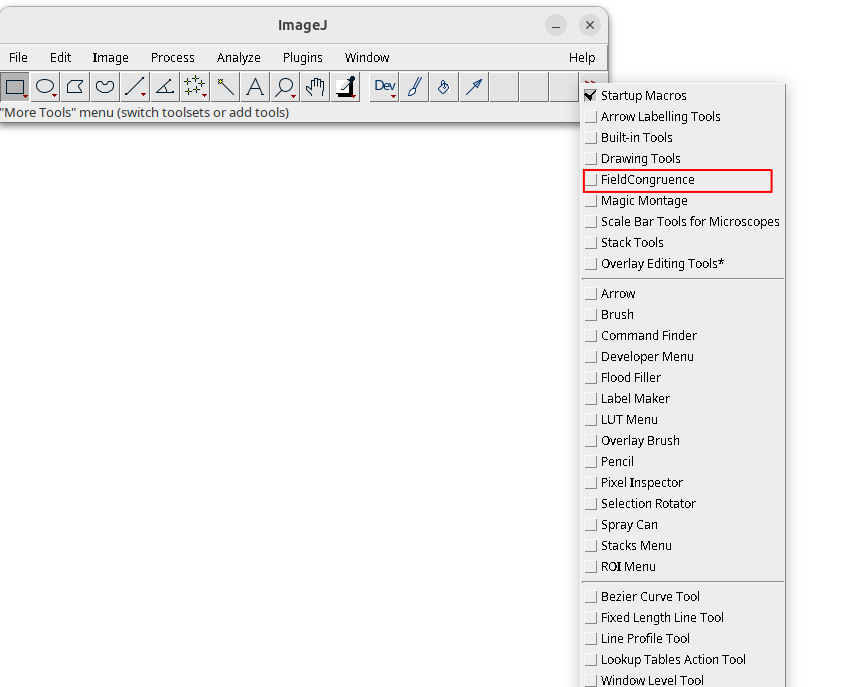

# field_congruence_using_film
A macro program written for Image J to analyze radiation field congruence in radiographic film

# Installation
1. Download the raw .ijm file.
2. Go to the folder where ImageJ is installed. Go to .../ImageJ/macros/toolsets
3. Paste the ijm file in the toolset folder
4. Open ImageJ.
5. Open an image in ImageJ.
6. Click on >> symbol at the end of the toolbar.\n
   
   
8. Click on 'FieldCongruence'.\n
   
   
10. An icon with 'F' should appear on the toolbar.\n
    
    

That's it! 

